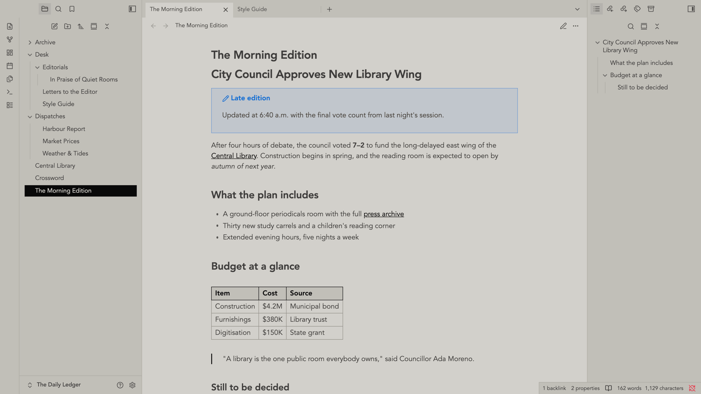
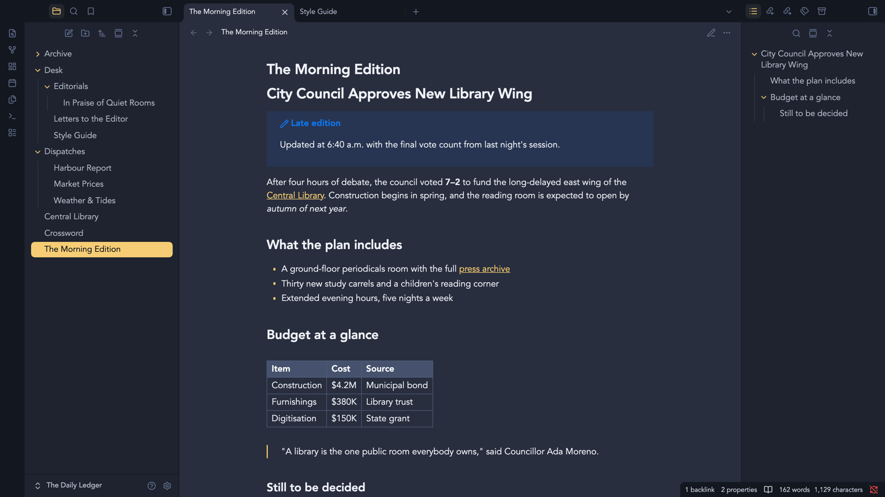

# Newspaper

A flat monochrome e-ink theme for [Obsidian](https://obsidian.md), built on
[Red Graphite](https://github.com/seanwcom/Red-Graphite-for-Obsidian).



The document you edit is newsprint: a toned page that never reaches white,
near-black ink, squared corners, no shadows, and black hairline rules where a
boundary carries meaning. The accent is the ink — links are underlined ink,
active states are solid ink — so colour appears only where it means something.

The chrome is light newsprint too, a shade darker than the page so it frames it —
tab bar, sidebars, the file tree, panels, menus, and status bar are all paper with
ink text. Nothing is a dark slab, so third-party panels that use the standard
surface and text tokens stay readable. If you colour files with the File Color
plugin, its **background** mode reads best here: the hues show as chips in the
light tree, rather than as coloured text that would wash out on paper. The plugin
bakes those chips at 15%; a **File Color chip opacity** slider in Style Settings
overrides that so you can dial how strongly they show.

Typography is left alone. The theme sets colour and shape; fonts come from
Red Graphite's Style Settings text fields or from Obsidian's Appearance settings.

**Light mode is the newspaper scheme. Dark mode is Red Graphite's**, unchanged —
there is no newsprint dark palette.



## Installation

Not yet in the community directory. To install manually, copy `manifest.json` and
`theme.css` into `<vault>/.obsidian/themes/Newspaper/`, then pick **Newspaper** in
**Settings → Appearance → Themes**.

## Style Settings

With the [Style Settings](https://github.com/mgmeyers/obsidian-style-settings)
plugin installed you get:

- **Use Red Graphite's original light scheme** — off by default. Turning it on adds
  the `rg-classic-scheme` class, which drops the entire newspaper block out and
  leaves the scheme this theme was forked from in force: near-white page, red
  accent, rounded and shadowed components.
- **Base Color** — in the newspaper scheme this is the **ink**, and the paper is
  derived from it. Changing hue or saturation retints the paper; changing lightness
  moves ink and paper together.
- **Accent Color** — ink by default. Unlike Red Graphite, the newspaper scheme
  reads this setting directly rather than through `--accent-h/s/l`, so it keeps
  working even after you've set an accent in Appearance settings.
- **Flatten ink** — the document text is mottled by default, the way a press lays
  ink down unevenly so the paper bleeds through the letterforms. Turn this on for
  flat, even ink.
- **Ink unevenness** — how far the paper bleeds through (0 = flat).
- Interface, text and monospace fonts.

## How the newspaper scheme works

Red Graphite derives its whole palette from one HSL base color, walking lightness
away from it in 5% steps. **That curve cannot produce newsprint.** The page sits 80
steps from the ink, which on a linear ramp is `base_l + 80%` — at or near pure
white for any usable ink. Newsprint's defining trait is paper that never reaches
white, so the light end of the ramp has to be compressed rather than extrapolated.

So the scheme is a second ramp, not a different base color. Both live in
[`src/scss/themes/_ramps.scss`](src/scss/themes/_ramps.scss): `linear` is Red
Graphite's original curve, refactored out of its two theme files and verified to
emit byte-identical declarations, and `newsprint` is the tuned one.

The tuning is constrained from two directions at once, because Red Graphite's
light scheme spends this single ramp on two jobs: its light end is both the page
surfaces **and** the text drawn on the near-black chrome, while its dark end is
both the ink on the page **and** the fills inside that chrome. Rather than bend the
curve to fit, [`theme-newspaper.scss`](src/scss/themes/theme-newspaper.scss) remaps
the roles that land on the wrong step — text drops one step darker, borders move
from step 30 to 40, and every accent-coloured cue sitting on the dark chrome
(vault name, sidebar icons, nav fills, collapse arrows) moves to the paper end,
since ink-on-ink is invisible. That last group is the price of ink-as-accent, and
it is paid there rather than by compromising the accent.

Measured against the page at the default ink lightness:

| Role | Step | Contrast |
| --- | --- | --- |
| `text-normal` | 100 | 12.8:1 |
| `text-muted` | 80 | 7.4:1 |
| `text-faint` | 70 | 4.7:1 |
| nav item on chrome | 40 | 8.6:1 |
| nav hover on chrome | 00 | 15.9:1 |

The palette values are ported from the `newspaper` appearance of another project.
That project's original token block is kept at
[`reference/newspaper-palette.css`](reference/newspaper-palette.css) for the
reasoning behind each value.

## Development

Copy `.env.example` to `.env` and point `OBSIDIAN_PATH` at a vault's theme folder,
so the build can copy the result straight in.

```bash
npm install
npm run dev     # watch src/, rebuild, copy into the vault
npm run build   # build and copy once
npm run build:ci  # compile only, no .env and no copy
```

`theme.css` is generated from `src/` and **is** committed, since Obsidian installs
it directly. Never edit it by hand — CI rebuilds and fails if the committed copy is
stale.

## Releasing

1. `npm version <patch|minor|major>` — runs `version-bump.mjs`, syncing
   `manifest.json` and adding a `versions.json` entry.
2. `git push && git push --tags`.
3. `.github/workflows/release.yml` creates a **draft** release with `manifest.json`
   and `theme.css` attached. Review, then publish.

## Credits

Forked from [Red Graphite for Obsidian](https://github.com/seanwcom/Red-Graphite-for-Obsidian)
by Sean Williams, which is released into the public domain under the Unlicense and
which in turn takes its colours from Bear.app's Red Graphite theme. The SCSS layout,
Grunt build and every `app/` and `plugins/` component style are Sean's work; the
newspaper ramp and scheme are the additions here.

## License

MIT — see [LICENSE](LICENSE).
